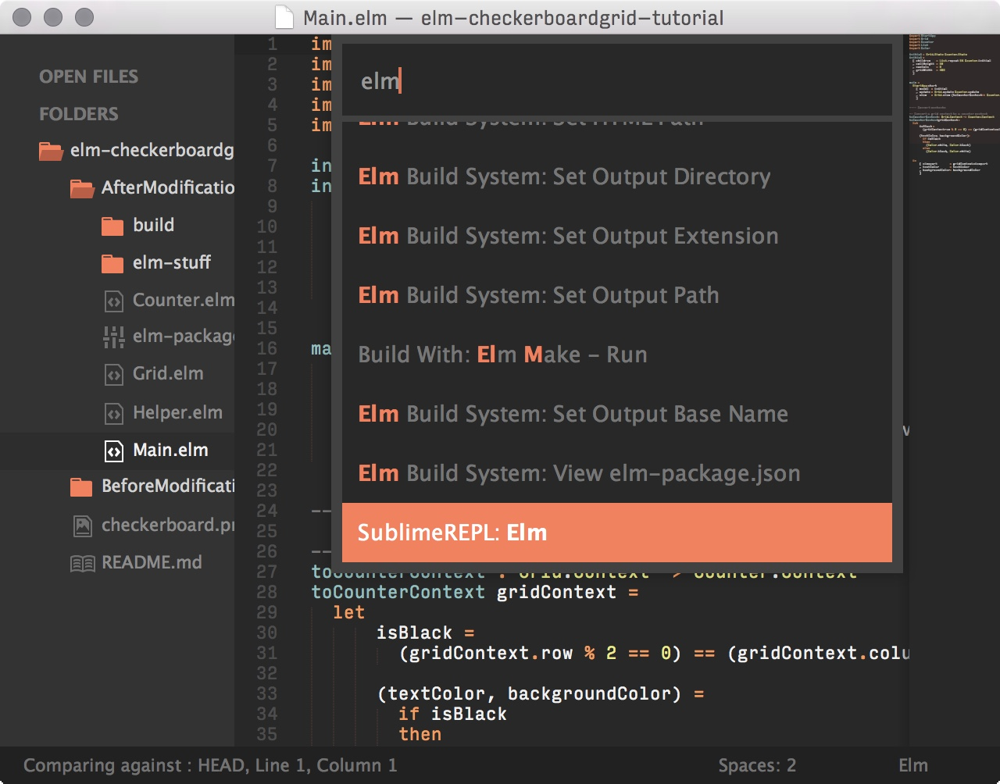
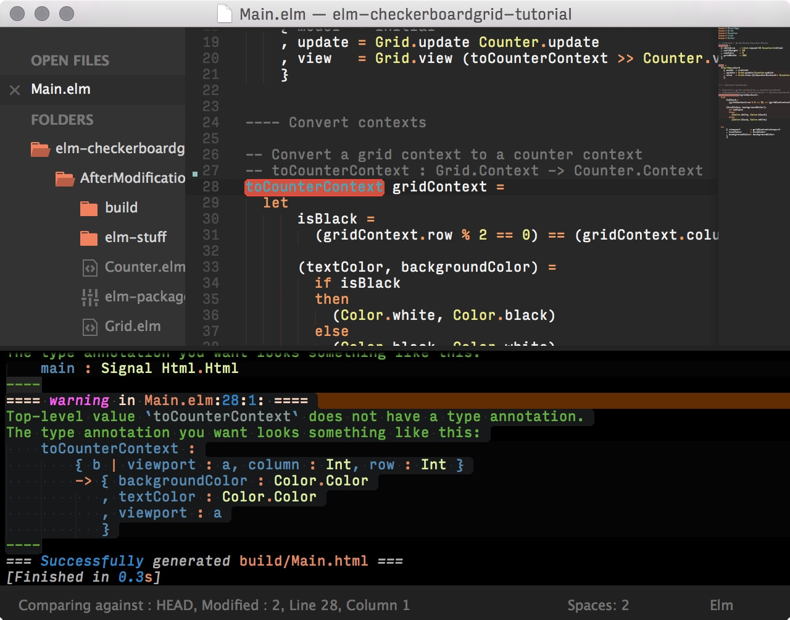
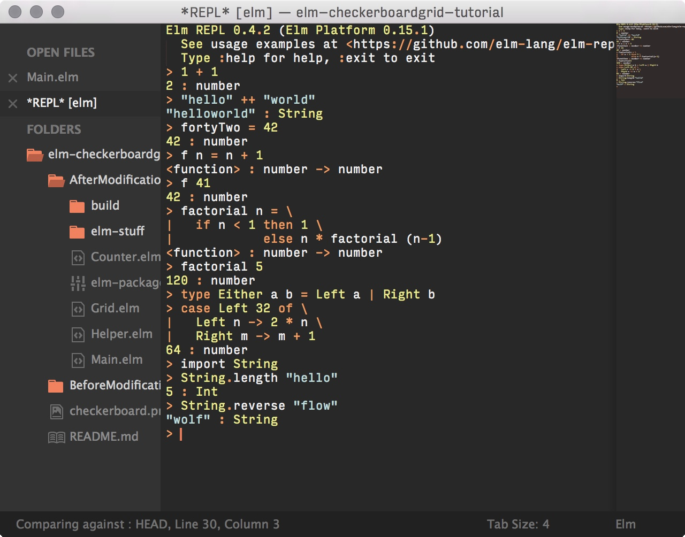

# The Sublime Elm Language Package

## Installation

1. Install [Package Control][]
2. Run `Package Control: Install Package` in the Command Palette (<kbd>Super+Shift+P</kbd>)
3. Install [Elm][] or use [NPM][] (`npm i -g elm`)

## Features

- Compatible with [Sublime Text 2] and [Sublime Text 3]
- Syntax highlighting
- Four standard build commands (<kbd>Super+[Shift]+B</kbd> or <kbd>Super+[Shift]+F7</kbd>)
    1. `Build` just checks errors. Kudos to this [tweet][]!
    2. `Run` additionally outputs your compiled program to an inferred path.
    3. The same as the above two, but ignoring warnings
    4. Output path is configurable in `elm-package.json` or `Elm Build System: …` in the Command Palette. Elm build system only requires a valid config in any ancestor directory of the active file. 
- Compile messages
    1. Navigate errors and warnings (<kbd>Super+[Shift]+F4</kbd>).
    2. Formatted for build output panel.
    3. Compile message highlighting, embedded code highlighting, and color scheme for output panel. 
- Integration with popular plugins (installed separately)
    1. [SublimeREPL][] — Run `elm-repl` in an editor tab with syntax highlighting. 
    2. [Highlight Build Errors][] — Does what it says on the box … usually.
- Integration with [elm format](https://github.com/avh4/elm-format)
    1. Make sure `elm-format` is in your PATH
    2. Run the "Elm Language Support: Run elm-format" command from the Command Palette to run elm-format on the current file
    2. To enable automatic formatting on every save, Go to Preferences -> Package Settings -> SublimeOnSaveBuild -> User and add this setting:
        `"elm_format_on_save": true`

## Learning

Don't know Elm? Great first step!

- [Official Elm Hub][]
- [Community Forum][]
- [Pragmatic Studio][]
- [ElmCast][]

[Community Forum]: https://groups.google.com/d/forum/elm-discuss
[Elm]: http://elm-lang.org/install
[ElmCast]: http://elmcast.io
[Highlight Build Errors]: https://packagecontrol.io/packages/Highlight%20Build%20Errors
[NPM]: https://nodejs.org
[Official Elm Hub]: http://elm-lang.org
[Package Control]: https://packagecontrol.io/installation
[Pragmatic Studio]: https://pragmaticstudio.com/elm
[SideBarEnhancements]: https://packagecontrol.io/packages/SideBarEnhancements
[SublimeREPL]: https://packagecontrol.io/packages/SublimeREPL
[View In Browser]: https://packagecontrol.io/packages/View%20In%20Browser
[Sublime Text 2]: http://www.sublimetext.com/2
[Sublime Text 3]: http://www.sublimetext.com/3
[tweet]: https://twitter.com/rtfeldman/status/624026168652660740
